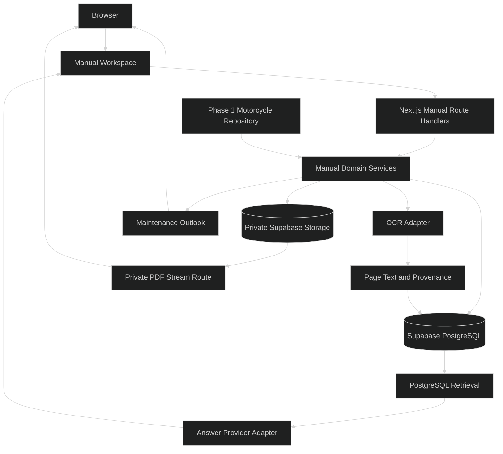

# MotoMemory Phase 2 — Manual Ingestion Implementation Plan

This plan turns the [Phase 2 CONOPS](./PHASE_2_CONOPS.md) into an executable implementation sequence. It begins after Phase 1: the Next.js App Router application, private Supabase PostgreSQL database, motorcycle dashboard, and manual mileage update flow are already working.

Phase 2 implements one upload-only, scanned 67-page/3.7 MB service manual for the 1981 Suzuki GS750. The original PDF remains private behind the server-side application path. OCR creates searchable text, the browser-native PDF surface shows the original document, citations retain PDF page indexes and printed page labels when available, extracted facts are active by default, and a rider can correct a fact from its source-linked view without a review queue.

## Table of Contents

- [Overview](#overview)
- [Goals and Boundaries](#goals-and-boundaries)
- [Methodology](#methodology)
- [Architecture](#architecture)
  - [System Architecture](#system-architecture)
  - [Data Flow](#data-flow)
  - [Proposed File Tree](#proposed-file-tree)
  - [Data Model Plan](#data-model-plan)
- [Implementation Phases](#implementation-phases)
  - [Phase 1: Capability Spike and Foundation](#phase-1-capability-spike-and-foundation)
  - [Phase 2: Private Document Storage and Schema](#phase-2-private-document-storage-and-schema)
  - [Phase 3: Upload Lifecycle and Manual API](#phase-3-upload-lifecycle-and-manual-api)
  - [Phase 4: Manual Workspace and PDF Viewer](#phase-4-manual-workspace-and-pdf-viewer)
  - [Phase 5: OCR Ingestion and Page Provenance](#phase-5-ocr-ingestion-and-page-provenance)
  - [Phase 6: Retrieval and Manual-Grounded Answers](#phase-6-retrieval-and-manual-grounded-answers)
  - [Phase 7: Maintenance Facts and Corrections](#phase-7-maintenance-facts-and-corrections)
  - [Phase 8: Hardening and Handoff](#phase-8-hardening-and-handoff)
- [Test Plan](#test-plan)
  - [Unit Testing Strategy](#unit-testing-strategy)
  - [Integration Testing Strategy](#integration-testing-strategy)
  - [End-to-End Testing Strategy](#end-to-end-testing-strategy)
  - [Acceptance Evidence](#acceptance-evidence)
- [Operational Safety and Rollback](#operational-safety-and-rollback)
  - [Upload atomicity](#upload-atomicity)
  - [Ingestion retry safety](#ingestion-retry-safety)
  - [Correction safety](#correction-safety)
  - [Private access](#private-access)
- [Definition of Done](#definition-of-done)
- [Deferred Work](#deferred-work)
- [References](#references)

## Overview

### Outcome

Phase 2 turns the deferred Manual navigation item into a useful source workspace. The owner can upload the selected PDF, see processing status, open the original document, browse pages, ask source-backed questions, inspect citations, see extracted maintenance facts, and correct a captured fact when the scan proves the OCR wrong.

### Implementation choices

| Area | Phase 2 choice |
|---|---|
| Document scope | One active PDF for the fixed `gs750` motorcycle |
| Intake | Upload only |
| Starting limits | 25 MB and 100 pages |
| Selected source | Scanned PDF, 67 pages, 3.7 MB |
| Original storage | Private Supabase Storage bucket accessed through the server |
| PDF viewer | Browser-native PDF surface with a small MotoMemory wrapper |
| OCR | Server-side OCR behind a replaceable adapter |
| Search | PostgreSQL full-text search first; no vector database in this phase |
| Answers | Provider-neutral answer interface, selected after OCR output exists |
| Facts | Ingest by default; source-linked direct correction; no approval queue |
| Access | Private server-side route; no public document URL or public bucket |
| Manual versions | Not supported; identical reuploads are rejected |

## Goals and Boundaries

### Goals

- Replace the provisional Phase 1 maintenance source when the manual contains usable mileage-based facts.
- Preserve the original scanned PDF as the source a rider can inspect.
- Account for all 67 pages and retain page-level provenance for OCR text, search results, answers, and maintenance facts.
- Make the Manual tab a working route from the existing left rail.
- Let the rider correct an ingested task, interval, unit, or note without approving every extracted fact.
- Keep the Phase 1 dashboard and manual mileage behavior working when manual processing or answering is unavailable.

### Boundaries

This plan does not include:

- Authentication, accounts, multiple motorcycles, public deployment, or public demo access.
- Multiple manuals, supplements, replacement lineage, or citation migration.
- A human review queue, approval workflow, confidence dashboard, or document-quality management system.
- Service records, completed-maintenance events, parts, costs, overdue calculations, mobile, GPS, or ride tracking.
- A final answer-model provider choice before the OCR and retrieval corpus exists.
- Custom PDF thumbnails, custom zoom, custom search, or custom print controls.
- Committing the owner's actual manual PDF to the repository. The real PDF remains a private local/storage fixture.

## Methodology

The implementation follows a vertical, evidence-driven sequence. Each phase leaves behind a usable boundary that the next phase can exercise:

1. Prove that the selected scanned PDF can be parsed, rendered, and OCR'd page by page.
2. Store the original file and metadata before building any generated knowledge.
3. Build the Manual route and original-PDF viewer independently from OCR so source browsing survives processing failures.
4. Process OCR output page by page with resumable status and source metadata.
5. Start retrieval with PostgreSQL full-text search because the first corpus is one 67-page document. Add semantic/vector retrieval only if the acceptance questions show a measurable recall problem.
6. Keep the answer model behind a focused interface. The model receives retrieved passages and provenance, never the entire untracked document by default.
7. Promote extracted maintenance facts by default and make corrections explicit, source-linked edits rather than approvals.
8. Use phase gates to stop when the original PDF, page mapping, OCR, or private access boundary is not trustworthy.

This approach keeps each responsibility separate: storage owns files, ingestion owns OCR, retrieval owns evidence selection, answering owns explanation, and the maintenance domain owns how accepted mileage intervals affect the dashboard. No UI component performs OCR, SQL, or answer-model calls directly.

## Architecture

### System Architecture



The browser talks only to Next.js routes and pages. The server owns PostgreSQL, private file storage, OCR, retrieval, and answer-provider credentials. The original PDF follows a separate stream path from OCR text so a failed ingestion cannot remove the source viewer.

### Data Flow

```mermaid
%%{init: {'theme':'dark'}}%%
flowchart LR
    Upload[Upload PDF] --> Hash[Hash and Validate]
    Hash -->|duplicate| Reject[409 Duplicate]
    Hash -->|new file| Store[Private File Storage]
    Store --> Register[Register Manual]
    Register --> Pages[Enumerate 67 Pages]
    Pages --> Render[Render Page Image]
    Render --> OCR[OCR Each Page]
    OCR --> Provenance[Store Text, PDF Page, Printed Label]
    Provenance --> Chunks[Create Search Chunks]
    Chunks --> Search[PostgreSQL Full-Text Search]
    Search --> Evidence[Ranked Evidence]
    Evidence --> Answer[Answer Provider]
    Evidence --> Citation[Citation with Page Targets]
    Citation --> Viewer[Native PDF Viewer]
    Provenance --> Facts[Maintenance Facts]
    Facts --> Correct[Optional Direct Correction]
    Correct --> Outlook[Manual-Derived Outlook]
```



### Proposed File Tree

The existing Phase 1 files remain in place. The following additions keep each responsibility focused:

```text
app/
  manual/
    page.tsx                              # Manual workspace route
  api/
    manual/
      route.ts                            # GET metadata / POST upload
      file/route.ts                       # private original-PDF stream
      ingest/route.ts                     # start or retry ingestion
      search/route.ts                     # retrieve page-aware evidence
      questions/route.ts                  # answer a manual-backed question
      facts/[factId]/route.ts             # correct an ingested fact

components/
  manual-workspace.tsx                    # client workspace state
  manual-upload-form.tsx                  # upload-only intake
  manual-status.tsx                       # uploaded/processing/ready/failed
  manual-pdf-viewer.tsx                   # native PDF wrapper and page target
  manual-source-list.tsx                  # evidence and citation links
  manual-facts-panel.tsx                  # source-linked facts and correction UI

lib/
  data/
    manual-repository.ts                  # PostgreSQL manual metadata and facts
    manual-storage.ts                     # private PDF storage adapter
  domain/
    manual-types.ts                       # manual, page, chunk, citation contracts
    manual-validation.ts                  # file, size, page-count, duplicate rules
    maintenance.ts                        # existing outlook calculations plus sources
  manual/
    pdf-reader.ts                         # page count, rendering, printed-label extraction
    ocr.ts                                # OCR provider interface and adapter
    ingestion.ts                          # resumable page processing orchestration
    chunking.ts                           # page-aware searchable chunks
    retrieval.ts                          # PostgreSQL evidence retrieval
    answering.ts                          # provider-neutral answer interface

supabase/
  migrations/
    004_phase2_manual_schema.sql
    005_phase2_manual_indexes.sql

tests/
  fixtures/
    scanned-manual-fixture.pdf            # synthetic/non-copyright test fixture
  unit/
    manual-validation.test.ts
    manual-ingestion.test.ts
    manual-retrieval.test.ts
    manual-facts.test.ts
  integration/
    manual-repository.test.ts
    manual-storage.test.ts
    manual-routes.test.ts
  e2e/
    manual-workflow.spec.ts
```

Names can change during implementation, but the storage, OCR, retrieval, answer, and correction responsibilities should not collapse into one repository or UI component.

### Data Model Plan

The Phase 2 migration extends the existing `maintenance_definitions` table and adds document-processing tables. The original PDF is stored outside PostgreSQL; PostgreSQL stores identity, status, provenance, searchable text, and derived facts.

```text
manual_documents
  id: uuid primary key
  motorcycle_id: text references motorcycle_state(id)
  file_name: text
  content_type: text
  storage_key: text unique
  file_size_bytes: bigint
  sha256: text
  page_count: integer
  status: uploaded | processing | ready | failed
  extraction_method: ocr
  error_message: text?
  uploaded_at: timestamptz
  processed_at: timestamptz?

manual_pages
  id: uuid primary key
  manual_id: uuid references manual_documents(id)
  page_number: integer                 # PDF page index, 1-based
  printed_page_label: text?
  extracted_text: text?
  extraction_status: available | failed
  error_message: text?

manual_chunks
  id: uuid primary key
  manual_id: uuid references manual_documents(id)
  page_start: integer
  page_end: integer
  printed_page_start: text?
  printed_page_end: text?
  section_label: text?
  content: text
  search_vector: tsvector
  processor_version: text?

maintenance_definitions additions
  source_manual_id: uuid?
  source_page_start: integer?
  source_page_end: integer?
  source_printed_page_label: text?
  origin: ocr | rider_corrected
  corrected_at: timestamptz?
```

Constraints and indexes:

- `manual_documents(motorcycle_id, sha256)` is unique, so an identical reupload returns a duplicate response without restarting ingestion.
- `manual_documents(motorcycle_id)` is also unique for the first-release one-manual-per-motorcycle scope.
- `manual_pages(manual_id, page_number)` is unique and supports page accounting and direct citation navigation.
- `manual_chunks(manual_id, page_start, page_end)` supports source display and citation lookup.
- A GIN index on `manual_chunks.search_vector` supports PostgreSQL full-text retrieval.
- `maintenance_definitions(motorcycle_id, source_manual_id)` supports source-backed outlook reads.
- Existing Phase 1 `maintenance_definitions(motorcycle_id, name)` uniqueness remains; ingestion upserts a matching task and disables the provisional Phase 1 row only when a usable manual-derived replacement exists.

The source page and raw OCR text remain available after a rider correction. The correction changes the active maintenance value and records `origin = rider_corrected`; it does not create a review state or a second manual version.

## Implementation Phases

### Phase 1: Capability Spike and Foundation

**Objective:** Prove the selected scanned PDF can be processed locally before committing the application to an OCR implementation.

**Deliverables:**

- Server-only PDF capability check for page count and page extraction.
- OCR adapter interface with a local first implementation candidate.
- Processing of a small sample of pages from the real 67-page PDF without committing the PDF to Git.
- Confirmation that OCR output can be linked to a 1-based PDF page index.
- Confirmation that printed page labels can be retained when detectable and left blank when not.
- Decision record for the PDF renderer and OCR engine based on the sample.

**Go Criteria:**

- The real scanned PDF opens successfully.
- Sample pages render as images and return searchable OCR text.
- OCR output and the original page can be correlated without guessing page numbers.
- The selected approach can run in the server-side Node runtime or in a documented local worker process.

**No-Go Criteria:**

- The PDF cannot be parsed or rendered reliably.
- OCR output cannot be mapped back to source pages.
- The candidate requires browser-only execution or exposes the original file outside the private server path.

**Dependencies:** Phase 1 application and local environment.

### Phase 2: Private Document Storage and Schema

**Objective:** Add durable metadata and private original-file storage without changing Phase 1 mileage behavior.

**Deliverables:**

- Versioned SQL migration for `manual_documents`, `manual_pages`, and `manual_chunks`.
- Phase 2 columns and source indexes on `maintenance_definitions`.
- Private Supabase Storage bucket and server-only storage adapter.
- Server-only environment variables documented in `.env.example`.
- SHA-256 and page-count constraints represented in the repository boundary.

**Go Criteria:**

- Migrations apply cleanly to the existing Phase 1 database.
- The original PDF can be stored and read through the server adapter.
- No public bucket or direct public storage URL is created.
- The existing motorcycle overview and mileage tests remain unchanged and passing.

**No-Go Criteria:**

- The storage adapter requires browser credentials.
- A failed database write leaves an untracked stored object without a cleanup path.
- The migration changes the semantics of Phase 1 mileage or provisional schedule behavior.

**Dependencies:** Phase 1 capability spike; private Supabase project.

### Phase 3: Upload Lifecycle and Manual API

**Objective:** Make upload-only intake, duplicate rejection, processing status, and retry behavior observable through the application.

**Deliverables:**

- `POST /api/manual` for multipart upload.
- `GET /api/manual` for current document metadata and status.
- File validation for PDF content, 25 MB limit, and 100-page limit.
- SHA-256 duplicate detection returning a stable duplicate error.
- `POST /api/manual/ingest` to start or retry processing.
- Idempotent status transitions: `uploaded → processing → ready|failed`.
- Cleanup behavior when storage or metadata registration fails.

**Go Criteria:**

- The 67-page/3.7 MB manual uploads successfully.
- An identical second upload is rejected and does not create a second document or restart OCR.
- A deliberately failed processing attempt leaves the original PDF viewable and retryable.
- The UI never reports `ready` before the original file and page-processing result are available.

**No-Go Criteria:**

- Duplicate uploads create multiple active manual records.
- A failed retry removes or replaces the original PDF.
- File-size or page-count checks can be bypassed through a route or alternate content type.

**Dependencies:** Phase 2 storage and schema.

### Phase 4: Manual Workspace and PDF Viewer

**Objective:** Turn the left-rail Manual item into a working page that displays the actual private PDF.

**Deliverables:**

- Manual navigation from `components/motorcycle-main-view.tsx` to `/manual`.
- Upload form, current manual status, and retry action.
- Private PDF stream route with `application/pdf` and inline browser display.
- Browser-native PDF surface with a page target for citations.
- PDF page index shown for navigation and printed page label shown when available.
- Return path to Dashboard that preserves Phase 1 state.
- Loading, missing-document, processing, failed, and render-unavailable states.

**Go Criteria:**

- A rider can upload the manual, open it from Manual, browse it with native controls, and return to Dashboard.
- A citation target opens the intended PDF page in the supported browser.
- The original PDF remains viewable when OCR or answer generation is unavailable.
- The route does not expose a public storage URL.

**No-Go Criteria:**

- The viewer displays only OCR text rather than the original PDF.
- A missing or failed PDF produces an apparently valid blank viewer.
- The viewer requires custom thumbnail, zoom, or search functionality before the phase can pass.

**Dependencies:** Phase 3 upload metadata and private file route.

### Phase 5: OCR Ingestion and Page Provenance

**Objective:** OCR all pages, preserve page provenance, and create searchable chunks without a human approval gate.

**Deliverables:**

- Resumable page-by-page ingestion worker.
- Page rendering and server-side OCR adapter.
- Page records for all 67 PDF pages, including explicit failure records.
- Printed page-label extraction when detectable; blank when not reliable.
- Page-aware chunks with PDF page index and printed page range.
- PostgreSQL full-text search vector and GIN index.
- Progress/status reporting and retry from the first incomplete page.
- Original scan retained independently of OCR output.

**Go Criteria:**

- 67 of 67 pages are accounted for as OCR available or explicit OCR failure.
- Every searchable chunk has a PDF page index.
- OCR failure is visible and does not delete or hide the original page.
- A search query returns source-linked passages from the expected page range.
- Processing can be retried without duplicating pages or chunks.

**No-Go Criteria:**

- OCR text cannot be traced to a source page.
- The worker silently skips a page.
- A retry creates duplicate chunks or changes the source manual identity.
- OCR processing runs in the browser or requires the original file to be public.

**Dependencies:** Phases 1–4.

### Phase 6: Retrieval and Manual-Grounded Answers

**Objective:** Answer manual questions from retrieved OCR passages with page citations while keeping the answer provider replaceable.

**Deliverables:**

- Retrieval service using PostgreSQL full-text search and ranked page-aware chunks.
- `POST /api/manual/search` returning passages, PDF page indexes, and printed labels.
- `POST /api/manual/questions` using an `AnswerProvider` interface.
- A server-only fail-closed default provider; production provider selection remains a configuration decision.
- Provider configuration kept server-side and isolated from the domain layer.
- Answer states for supported evidence, insufficient evidence, provider unavailable, and citation mismatch.
- Citation links that open the native PDF viewer at the cited PDF page.
- A 10-question evaluation set, including at least 2 questions absent from the manual.

**Go Criteria:**

- At least 9 of 10 answerable questions return relevant evidence.
- Every accepted answer includes the correct manual identity and PDF page reference.
- At least 2 unanswered questions are labeled insufficient rather than answered from model memory.
- The answer provider receives retrieved passages and provenance, not an unbounded full-manual prompt by default.
- A provider outage leaves PDF browsing and evidence search available.

**No-Go Criteria:**

- Accepted answers have no source page.
- The system confidently answers a question when retrieval returns no supporting passage.
- A provider-specific SDK leaks into the manual domain and blocks changing providers.

**Dependencies:** Phase 5 OCR chunks and a selected answer-provider configuration.

### Phase 7: Maintenance Facts and Corrections

**Objective:** Replace the provisional 1,000-mile cadence with ingested manual facts where enough task and unit context exists, while allowing direct source-linked corrections.

**Deliverables:**

- Extraction/upsert path for manual-derived mileage maintenance definitions.
- Source page, printed label, and raw OCR context displayed with each fact.
- Direct correction action for task, interval, unit, or note.
- Correction metadata with `origin = rider_corrected` and `corrected_at`.
- Transactional update that recalculates the maintenance outlook after a correction.
- Provisional Phase 1 definition disabled only when a usable manual-derived replacement exists; fallback remains visible otherwise.
- No approval queue, review state, or second manual version.

**Go Criteria:**

- A manual-derived fact appears with a source link and replaces the provisional cadence when it can calculate a mileage outlook.
- A rider can correct one fact and see the corrected value reflected in the outlook after refresh.
- The original OCR text and PDF source remain available after correction.
- A correction cannot modify the motorcycle mileage or create a service-history event.

**No-Go Criteria:**

- Facts cannot be traced to a page.
- A correction silently changes the original PDF or OCR evidence.
- The implementation requires approving all facts before any can be used.

**Dependencies:** Phases 5–6 and existing maintenance outlook calculations.

### Phase 8: Hardening and Handoff

**Objective:** Verify the complete private workflow and document how Phase 3 can safely build on it.

**Deliverables:**

- Unit, integration, and end-to-end test coverage for the Phase 2 gates.
- Real-manual local acceptance record kept outside Git.
- README/local-development updates for storage credentials, upload, ingestion, retry, and reset behavior.
- Phase 2 completion note with measured page coverage, OCR failures, retrieval results, and answer-provider choice.
- Explicit list of deviations from the CONOPS.

**Go Criteria:**

- All Phase 2 acceptance evidence is recorded.
- `npm run lint`, `npm run typecheck`, `npm run test:unit`, `npm run test:integration`, `npm run test:e2e`, and `npm run build` pass.
- Phase 1 dashboard and mileage behavior pass unchanged.
- No private manual file or secret is committed.

**No-Go Criteria:**

- A source-backed answer cannot open its cited page.
- OCR page coverage is incomplete without visible failure records.
- The private PDF route can be bypassed through a public storage URL.

**Dependencies:** Phases 1–7.

## Test Plan

### Unit Testing Strategy

Unit tests should stay independent of Supabase, OCR workers, and answer providers wherever possible.

Cover these behaviors:

- File validation accepts a real PDF under 25 MB and 100 pages.
- File validation rejects non-PDF content, empty files, files over 25 MB, and documents over 100 pages.
- SHA-256 comparison identifies an identical upload for the same motorcycle.
- A different PDF is not treated as an identical duplicate merely because the name matches.
- Status transitions reject invalid regressions and repeated completion.
- Page numbering is 1-based and every page result retains its manual identity.
- Printed page labels remain optional and are never guessed.
- OCR page failures are represented explicitly rather than as missing rows.
- Chunk ranges never point outside the document page count.
- Retrieval ranks matching passages and returns page provenance.
- Empty retrieval produces an insufficient-evidence result.
- Citation targets preserve PDF page index and printed label independently.
- Maintenance corrections update the active fact origin and timestamp without changing motorcycle mileage.
- Manual-derived definitions replace the provisional definition only when their required mileage context exists.
- Existing Phase 1 mileage and outlook calculations remain unchanged.

### Integration Testing Strategy

Integration tests should use a disposable or isolated PostgreSQL/Supabase environment and mocked external adapters.

Verify:

- Phase 2 migrations apply after the Phase 1 migrations.
- The existing `gs750` row and mileage function remain usable.
- Upload metadata, page records, chunks, and maintenance sources persist together.
- A duplicate upload returns a stable conflict and leaves the database/storage state unchanged.
- Storage failure rolls back metadata registration or cleans up the orphaned object.
- Database failure after upload does not report success.
- Private PDF streaming returns the original bytes and correct content type without exposing a public URL.
- Ingestion retries only incomplete pages and does not duplicate page or chunk rows.
- A mocked OCR adapter can produce available and failed page outcomes.
- Retrieval returns the expected source page range from seeded chunks.
- A mocked answer provider receives only retrieved evidence and returns citations.
- Provider failure leaves search and PDF browsing available.
- Fact correction updates the maintenance outlook transactionally and preserves source metadata.

### End-to-End Testing Strategy

Use a small synthetic scanned PDF fixture for repeatable automated browser tests. Keep the owner's real manual outside the repository and run it as a local acceptance fixture.

The browser journey should cover:

1. Open the dashboard and select Manual from the left rail.
2. Upload a valid PDF and see uploaded/processing/ready states.
3. Reject an identical reupload with a clear message.
4. Open the original PDF in the browser-native surface.
5. Navigate to a cited PDF page and see the printed label when available.
6. Search or ask a question and inspect the source result.
7. Open a maintenance fact, correct it, and confirm the outlook updates.
8. Return to Dashboard and verify Phase 1 mileage remains unchanged.
9. Simulate OCR failure and confirm the original PDF remains viewable.
10. Simulate answer-provider failure and confirm source browsing remains available.

### Acceptance Evidence

Record the following for the selected 67-page manual:

- File size, page count, SHA-256, and selected motorcycle association.
- Count of pages with OCR available and count with explicit OCR failure.
- Count of searchable chunks with page provenance.
- Count of extracted maintenance facts with source pages.
- The 10-question evaluation set and retrieval/answer outcomes.
- At least 2 unsupported questions and their insufficient-evidence behavior.
- One duplicate-upload attempt and its unchanged-state result.
- One source-linked fact correction and the resulting outlook.
- Browser and runtime used for native PDF page navigation.

## Operational Safety and Rollback

### Upload atomicity

1. Validate request shape, content type, byte limit, page limit, and hash before registering a new document.
2. Reject a duplicate before creating a new storage object.
3. Store the original PDF in the private bucket.
4. Register metadata only after storage succeeds.
5. If metadata registration fails, remove the newly created object using its exact storage key.

No broad cleanup or recursive deletion is part of this workflow. Cleanup targets only the storage key created by the current request.

### Ingestion retry safety

- The original PDF is immutable during OCR.
- Page rows are upserted by `(manual_id, page_number)`.
- Chunks are replaced only for the same manual and processing attempt.
- A retry resumes failed or incomplete pages and leaves successful page text intact unless explicitly reprocessed.
- A failed retry leaves the original source viewable.

### Correction safety

- Corrections update the active maintenance fact, not the original PDF or raw OCR page text.
- Corrections record `origin = rider_corrected` and `corrected_at`.
- The update and outlook recalculation use one server-side transaction where practical.
- A correction failure leaves the last accepted fact and motorcycle mileage unchanged.

### Private access

- Use a private storage bucket.
- Keep storage credentials server-only.
- Stream the file through a server route with `Content-Type: application/pdf` and inline disposition.
- Do not persist public URLs in the database or render service-role credentials into client code.
- Do not deploy this route publicly before authentication and ownership are designed.

## Definition of Done

Phase 2 is complete when:

- One 67-page scanned PDF uploads within the 25 MB/100-page limits.
- Identical reuploads are rejected without changing the current source.
- The original PDF is stored privately and viewable through the Manual tab.
- Browser-native page navigation works, with PDF page index and printed label shown when available.
- All 67 pages have OCR available or an explicit failure record.
- Every searchable passage and displayed maintenance fact has a PDF page reference.
- Retrieval returns relevant evidence for at least 9 of 10 answerable evaluation questions.
- At least 2 unsupported questions produce insufficient-evidence behavior.
- Manual-backed answers link to the original source page.
- Extracted facts are active by default and can be corrected from their source-linked view.
- The provisional 1,000-mile definition is replaced when a usable manual-derived mileage fact exists, with fallback behavior when it does not.
- No human approval queue, multiple-manual workflow, or public PDF access has been introduced.
- Phase 1 dashboard, mileage persistence, and error behavior remain intact.
- All validation scripts and tests pass, and acceptance evidence is documented.

## Deferred Work

- Authentication, user ownership, RLS, public deployment, and public demo access.
- Multiple manuals, supplements, replacement lineage, and citation migration.
- Vector embeddings or a vector database if PostgreSQL full-text retrieval proves insufficient.
- A different OCR engine or external OCR service if the local adapter does not meet the measured runtime or retrieval needs.
- Answer-provider selection beyond the Phase 2 adapter and evaluation boundary.
- Service history, overdue calculations, mobile, GPS, and ride tracking.
- Advanced PDF controls such as custom thumbnails, zoom, search, and print UI.

## References

Project references:

- [Phase 2 CONOPS](./PHASE_2_CONOPS.md)
- [MotoMemory master CONOPS](./MOTOMEMORY_CONOPS.md)
- [Phase 1 implementation plan](./PHASE_1_IMPLEMENTATION_PLAN.md)
- [Phase 1 completion note](./PHASE_1_COMPLETION.md)

Primary platform and library references:

- [Next.js Route Handlers](https://nextjs.org/docs/app/getting-started/route-handlers) - server-side request handlers for upload, file streaming, search, and corrections.
- [Next.js App Router](https://nextjs.org/docs/app) - current application routing and server/client boundary conventions.
- [Supabase Storage](https://supabase.com/docs/guides/storage) - private file buckets and server-mediated file access.
- [PostgreSQL Full Text Search](https://www.postgresql.org/docs/current/textsearch.html) - `tsvector`, ranking, and GIN-indexed retrieval baseline.
- [PDF.js](https://mozilla.github.io/pdf.js/) - candidate PDF parsing and page-rendering capability for the server-side OCR pipeline; it is not the browser-native viewer.
- [Tesseract.js](https://github.com/naptha/tesseract.js) - candidate server-side OCR adapter. It recognizes images rather than PDF files directly, so the implementation must render PDF pages before OCR.
